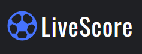

# <LiveScore>

## About

The most up-to-date soccer live scores, stats and other info from and more than 800 leagues from all around the world. With LiveScore, you won't miss a single goal ever again. You can check your favourite matches, teams or players, and our notifications will let you know about every important moment of the match.

## Demo

 Here is a working live demo : [DEMO](https://marcin082.github.io/livescore-app/)


## Built with
* JavaScrpit - ES6
* Css
* React
* Styled Components
* Context API
* [APIfootbal](https://apifootball.com/)

## Installation

### Install Node JS
Refer to [https://nodejs.org/en/](https://nodejs.org/en/) to install nodejs

### Install create-react-app
Install create-react-app npm package globally. This will help to easily run the project and also build the source files easily. Use the following command to install create-react-app

```bash
npm install -g create-react-app
```

## Cloning and Running the Application in local

Clone the project into local

Install all the npm packages. Go into the project folder and type the following command to install all npm packages

```bash
npm install
```

In order to run the application Type the following command

```bash
npm start
```

The Application Runs on **localhost:3000**


## Using API
To use API you have to get Apikey from [APIfootbal](https://apifootball.com/) and paste it in
** APIKEY ** variable in src/Context/MatchesContext


